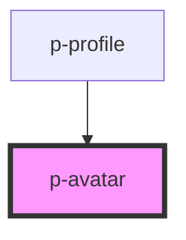

# Avatar

## Usage:

```html
<p-avatar src="url-of-your-image" />
```

<!-- Auto Generated Below -->


## Properties

| Property           | Attribute       | Description                         | Type                             | Default     |
| ------------------ | --------------- | ----------------------------------- | -------------------------------- | ----------- |
| `defaultImage`     | `default-image` | The default image to show on errors | `string`                         | `undefined` |
| `size`             | `size`          | The size of the avatar              | `"large" \| "medium" \| "small"` | `'medium'`  |
| `src` _(required)_ | `src`           | The image used for the avatar       | `string`                         | `undefined` |
| `variant`          | `variant`       | The variant of the avatar           | `"company" \| "user"`            | `'user'`    |


## Dependencies

### Used by

 - [p-profile](../../molecules/profile)

### Graph


----------------------------------------------

*Built with [StencilJS](https://stenciljs.com/)*
