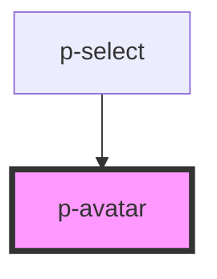

# Avatar

## Usage:

```html
<p-avatar src="url-of-your-image" />
```

<!-- Auto Generated Below -->


## Properties

| Property           | Attribute       | Description                                    | Type                                                                | Default     |
| ------------------ | --------------- | ---------------------------------------------- | ------------------------------------------------------------------- | ----------- |
| `defaultImage`     | `default-image` | The default image to show on errors            | `string`                                                            | `undefined` |
| `letters`          | `letters`       | The letters to show on the empty state variant | `string`                                                            | `' '`       |
| `size`             | `size`          | The size of the avatar                         | `"2xl" \| "3xl" \| "4xl" \| "base" \| "lg" \| "sm" \| "xl" \| "xs"` | `'base'`    |
| `src` _(required)_ | `src`           | The image used for the avatar                  | `string`                                                            | `undefined` |


## Dependencies

### Used by

 - [p-select](../../molecules/select)

### Graph


----------------------------------------------

*Built with [StencilJS](https://stenciljs.com/)*
