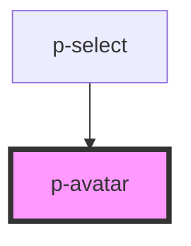

# Avatar

## Usage:

```html
<p-avatar src="url-of-your-image" />
```

<!-- Auto Generated Below -->


## Properties

| Property           | Attribute       | Description                                    | Type                                                     | Default     |
| ------------------ | --------------- | ---------------------------------------------- | -------------------------------------------------------- | ----------- |
| `defaultImage`     | `default-image` | The default image to show on errors            | `string`                                                 | `undefined` |
| `letters`          | `letters`       | The letters to show on the empty state variant | `string`                                                 | `undefined` |
| `size`             | `size`          | The size of the avatar                         | `"large" \| "medium" \| "small" \| "xlarge" \| "xsmall"` | `'medium'`  |
| `src` _(required)_ | `src`           | The image used for the avatar                  | `string`                                                 | `undefined` |
| `variant`          | `variant`       | The variant of the avatar                      | `"company" \| "user"`                                    | `'user'`    |


## Dependencies

### Used by

 - [p-select](../../molecules/select)

### Graph


----------------------------------------------

*Built with [StencilJS](https://stenciljs.com/)*
