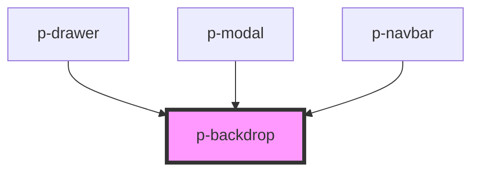

# p-backdrop

<!-- Auto Generated Below -->

## Properties

| Property     | Attribute     | Description                                            | Type                  | Default     |
| ------------ | ------------- | ------------------------------------------------------ | --------------------- | ----------- |
| `applyBlur`  | `apply-blur`  | Wether to apply blur on the background of the backdrop | `boolean`             | `false`     |
| `class`      | `class`       | The class passed to the component                      | `string`              | `undefined` |
| `closing`    | `closing`     | Wether the backdrop is closing                         | `boolean`             | `false`     |
| `scrollLock` | `scroll-lock` | Wether we should scroll lock the body                  | `boolean`             | `true`      |
| `variant`    | `variant`     | The variant of the backdrop                            | `"drawer" \| "modal"` | `'modal'`   |

## Events

| Event     | Description                  | Type                      |
| --------- | ---------------------------- | ------------------------- |
| `clicked` | When the backdrop is clicked | `CustomEvent<MouseEvent>` |

## Dependencies

### Used by

 - [p-drawer](../../organisms/drawer)
 - [p-modal](../../organisms/modal)
 - [p-navbar](../../organisms/navbar)

### Graph

----------------------------------------------

*Built with [StencilJS](https://stenciljs.com/)*
