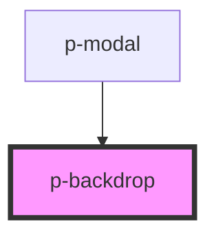

# Backdrop

## Usage:

```html
<p-backdrop>
    <!-- content -->
</p-backdrop>
```

<!-- Auto Generated Below -->


## Properties

| Property    | Attribute    | Description | Type      | Default |
| ----------- | ------------ | ----------- | --------- | ------- |
| `applyBlur` | `apply-blur` |             | `boolean` | `false` |


## Dependencies

### Used by

 - [p-modal](../../organisms/modal)

### Graph


----------------------------------------------

*Built with [StencilJS](https://stenciljs.com/)*
