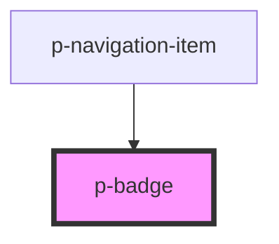

# Badge

## Usage:

```html
<p-badge> Content </p-badge>
```

<!-- Auto Generated Below -->


## Dependencies

### Used by

 - [p-navigation-item](../../molecules/navigation-item)

### Graph


----------------------------------------------

*Built with [StencilJS](https://stenciljs.com/)*
