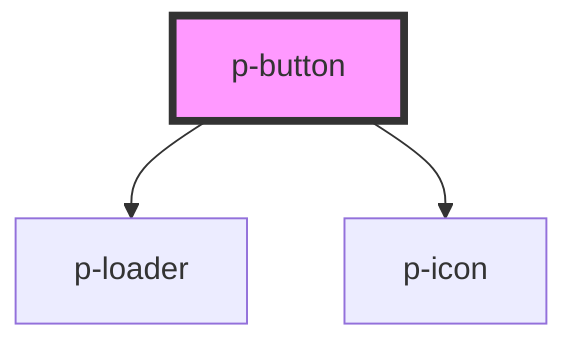

# Button

## Usage:

```html
<p-button>Label</p-button>
```

<!-- Auto Generated Below -->


## Properties

| Property       | Attribute       | Description                      | Type                                                                                                                                                                                                                                                                                                                                                                                                                                                                                                                                                                                   | Default     |
| -------------- | --------------- | -------------------------------- | -------------------------------------------------------------------------------------------------------------------------------------------------------------------------------------------------------------------------------------------------------------------------------------------------------------------------------------------------------------------------------------------------------------------------------------------------------------------------------------------------------------------------------------------------------------------------------------- | ----------- |
| `chevron`      | `chevron`       | Wether to show a chevron or not  | `"down" \| "up" \| boolean`                                                                                                                                                                                                                                                                                                                                                                                                                                                                                                                                                            | `false`     |
| `disabled`     | `disabled`      | Wether the button is disabled    | `boolean`                                                                                                                                                                                                                                                                                                                                                                                                                                                                                                                                                                              | `false`     |
| `href`         | `href`          | Href in case of "text" version   | `string`                                                                                                                                                                                                                                                                                                                                                                                                                                                                                                                                                                               | `undefined` |
| `icon`         | `icon`          | Icon to show on the button       | `"arrow" \| "attachment" \| "bread" \| "calendar" \| "car" \| "checklist" \| "checkmark" \| "chevron" \| "clock" \| "cogs" \| "comment" \| "document" \| "download" \| "envelope" \| "explanation" \| "eye" \| "filter" \| "folder" \| "grid" \| "headset" \| "integration" \| "list" \| "location" \| "megaphone" \| "minus" \| "negative" \| "pagination" \| "payment" \| "pencil" \| "person" \| "plus" \| "question" \| "receipt" \| "report" \| "search" \| "settings" \| "sick" \| "tachometer" \| "task" \| "template" \| "tool" \| "trash" \| "turn" \| "upload" \| "warning"` | `undefined` |
| `iconFlip`     | `icon-flip`     | Icon flip                        | `"horizontal" \| "vertical"`                                                                                                                                                                                                                                                                                                                                                                                                                                                                                                                                                           | `undefined` |
| `iconPosition` | `icon-position` | Icon position                    | `"end" \| "start"`                                                                                                                                                                                                                                                                                                                                                                                                                                                                                                                                                                     | `'end'`     |
| `iconRotate`   | `icon-rotate`   | Icon rotate                      | `number`                                                                                                                                                                                                                                                                                                                                                                                                                                                                                                                                                                               | `undefined` |
| `loading`      | `loading`       | Wether to show a loader or not   | `boolean`                                                                                                                                                                                                                                                                                                                                                                                                                                                                                                                                                                              | `false`     |
| `size`         | `size`          | The size of the button           | `"medium" \| "small"`                                                                                                                                                                                                                                                                                                                                                                                                                                                                                                                                                                  | `'medium'`  |
| `target`       | `target`        | Target in case of "text" version | `string`                                                                                                                                                                                                                                                                                                                                                                                                                                                                                                                                                                               | `undefined` |
| `variant`      | `variant`       | The variant of the button        | `"primary" \| "secondary" \| "text"`                                                                                                                                                                                                                                                                                                                                                                                                                                                                                                                                                   | `'primary'` |


## Events

| Event     | Description        | Type                      |
| --------- | ------------------ | ------------------------- |
| `onClick` | Button click event | `CustomEvent<MouseEvent>` |


## Dependencies

### Depends on

- [p-loader](../loader)
- [p-icon](../icon)

### Graph


----------------------------------------------

*Built with [StencilJS](https://stenciljs.com/)*
