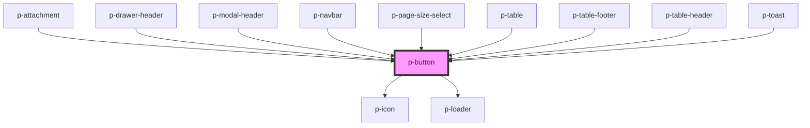

# p-button

<!-- Auto Generated Below -->

## Properties

| Property          | Attribute          | Description                                  | Type                                                                                                                                                                                                                                                                                                                                                                                                                                                                                                                                                                                                                                                                                                                                      | Default     |
| ----------------- | ------------------ | -------------------------------------------- | ----------------------------------------------------------------------------------------------------------------------------------------------------------------------------------------------------------------------------------------------------------------------------------------------------------------------------------------------------------------------------------------------------------------------------------------------------------------------------------------------------------------------------------------------------------------------------------------------------------------------------------------------------------------------------------------------------------------------------------------- | ----------- |
| `chevron`         | `chevron`          | Wether to show a chevron or not              | `"down" \| "up" \| boolean`                                                                                                                                                                                                                                                                                                                                                                                                                                                                                                                                                                                                                                                                                                               | `false`     |
| `chevronPosition` | `chevron-position` | Chevron position                             | `"end" \| "start"`                                                                                                                                                                                                                                                                                                                                                                                                                                                                                                                                                                                                                                                                                                                        | `'end'`     |
| `disabled`        | `disabled`         | Wether the button is disabled                | `boolean`                                                                                                                                                                                                                                                                                                                                                                                                                                                                                                                                                                                                                                                                                                                                 | `false`     |
| `href`            | `href`             | Href in case of "text" version               | `string`                                                                                                                                                                                                                                                                                                                                                                                                                                                                                                                                                                                                                                                                                                                                  | `undefined` |
| `icon`            | `icon`             | Icon to show on the button                   | `"arrow" \| "attachment" \| "bread" \| "calendar" \| "camera" \| "car" \| "checklist" \| "checkmark" \| "chevron" \| "clock" \| "colleagues" \| "cogs" \| "comment" \| "companies" \| "document" \| "download" \| "envelope" \| "explanation" \| "eye" \| "faBuilding" \| "faPiggy" \| "filter" \| "folder" \| "grid" \| "headset" \| "integration" \| "list" \| "location" \| "megaphone" \| "menu" \| "minus" \| "more" \| "negative" \| "notification" \| "pagination" \| "payment" \| "pencil" \| "person" \| "plus" \| "question" \| "reload" \| "receipt" \| "report" \| "search" \| "settings" \| "sick" \| "signout" \| "switch" \| "tachometer" \| "task" \| "template" \| "tool" \| "trash" \| "turn" \| "upload" \| "warning"` | `undefined` |
| `iconFlip`        | `icon-flip`        | Icon flip                                    | `"horizontal" \| "vertical"`                                                                                                                                                                                                                                                                                                                                                                                                                                                                                                                                                                                                                                                                                                              | `undefined` |
| `iconOnly`        | `icon-only`        | Wether the button is icon only               | `boolean`                                                                                                                                                                                                                                                                                                                                                                                                                                                                                                                                                                                                                                                                                                                                 | `false`     |
| `iconPosition`    | `icon-position`    | Icon position                                | `"end" \| "start"`                                                                                                                                                                                                                                                                                                                                                                                                                                                                                                                                                                                                                                                                                                                        | `'end'`     |
| `iconRotate`      | `icon-rotate`      | Icon rotate                                  | `-135 \| -180 \| -225 \| -25 \| -270 \| -315 \| -45 \| -90 \| 0 \| 135 \| 180 \| 225 \| 25 \| 270 \| 315 \| 45 \| 90`                                                                                                                                                                                                                                                                                                                                                                                                                                                                                                                                                                                                                     | `undefined` |
| `inheritText`     | `inherit-text`     | Wether the button should inherit text styles | `boolean`                                                                                                                                                                                                                                                                                                                                                                                                                                                                                                                                                                                                                                                                                                                                 | `false`     |
| `loading`         | `loading`          | Wether to show a loader or not               | `boolean`                                                                                                                                                                                                                                                                                                                                                                                                                                                                                                                                                                                                                                                                                                                                 | `false`     |
| `size`            | `size`             | The size of the button                       | `"medium" \| "small"`                                                                                                                                                                                                                                                                                                                                                                                                                                                                                                                                                                                                                                                                                                                     | `'medium'`  |
| `target`          | `target`           | Target in case of "text" version             | `string`                                                                                                                                                                                                                                                                                                                                                                                                                                                                                                                                                                                                                                                                                                                                  | `undefined` |
| `variant`         | `variant`          | The variant of the button                    | `"primary" \| "secondary" \| "text"`                                                                                                                                                                                                                                                                                                                                                                                                                                                                                                                                                                                                                                                                                                      | `'primary'` |

## Events

| Event     | Description        | Type                      |
| --------- | ------------------ | ------------------------- |
| `onClick` | Button click event | `CustomEvent<MouseEvent>` |

## Dependencies

### Used by

 - [p-attachment](../../molecules/attachment)
 - [p-drawer-header](../drawer-header)
 - [p-modal-header](../modal-header)
 - [p-navbar](../../organisms/navbar)
 - [p-page-size-select](../../molecules/page-size-select)
 - [p-table](../../organisms/table)
 - [p-table-footer](../../molecules/table-footer)
 - [p-table-header](../../molecules/table-header)
 - [p-toast](../../molecules/toast)

### Depends on

- [p-icon](../icon)
- [p-loader](../loader)

### Graph

----------------------------------------------

*Built with [StencilJS](https://stenciljs.com/)*
