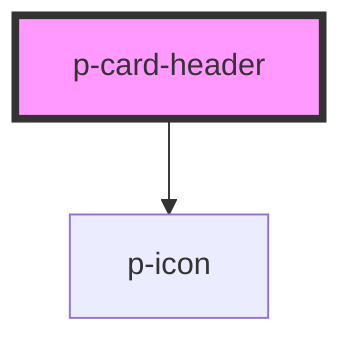

# Card Header

## Usage:

```html
<p-card-header>
    <!-- Content -->
</p-card-header>
```

<!-- Auto Generated Below -->


## Properties

| Property | Attribute | Description              | Type      | Default     |
| -------- | --------- | ------------------------ | --------- | ----------- |
| `arrow`  | `arrow`   | Enable the title arrow   | `boolean` | `false`     |
| `title`  | `title`   | Title of the card header | `string`  | `undefined` |


## Dependencies

### Depends on

- [p-icon](../icon)

### Graph


----------------------------------------------

*Built with [StencilJS](https://stenciljs.com/)*
