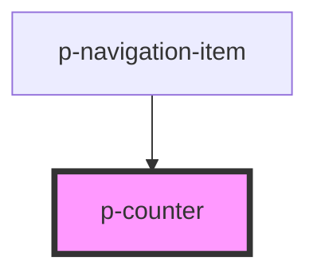

# Counter

## Usage:

```html
<p-counter>#</p-counter>
```

<!-- Auto Generated Below -->


## Properties

| Property  | Attribute | Description                | Type                                               | Default     |
| --------- | --------- | -------------------------- | -------------------------------------------------- | ----------- |
| `size`    | `size`    | The size of the counter    | `"default" \| "mini"`                              | `'default'` |
| `variant` | `variant` | The variant of the counter | `"info" \| "negative" \| "positive" \| "unbiased"` | `'info'`    |


## Dependencies

### Used by

 - [p-navigation-item](../../molecules/navigation-item)

### Graph


----------------------------------------------

*Built with [StencilJS](https://stenciljs.com/)*
