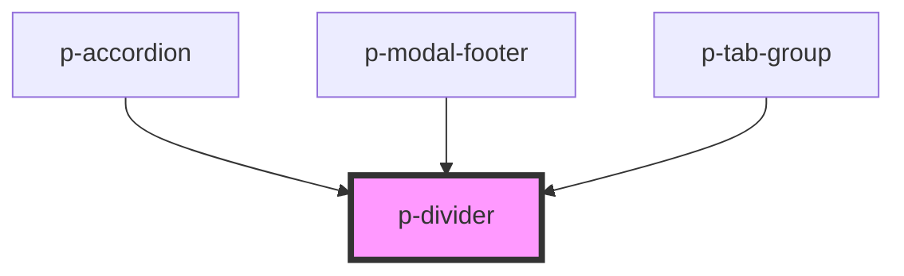

# Divider

## Usage:

```html
<p-divider />

<!-- or -->

<p-divider> Content </p-divider>
```

<!-- Auto Generated Below -->


## Dependencies

### Used by

 - [p-accordion](../../molecules/accordion)
 - [p-modal-footer](../modal-footer)
 - [p-tab-group](../tab-group)

### Graph


----------------------------------------------

*Built with [StencilJS](https://stenciljs.com/)*
