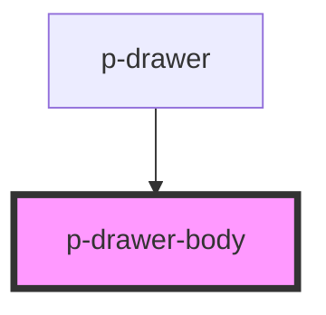

# Modal Body

## Usage:

```html
<p-drawer-body>
    <!-- content -->
</p-drawer-body>
```

<!-- Auto Generated Below -->


## Properties

| Property  | Attribute | Description                   | Type                   | Default     |
| --------- | --------- | ----------------------------- | ---------------------- | ----------- |
| `variant` | `variant` | The variant of the modal body | `"default" \| "table"` | `'default'` |


## Dependencies

### Used by

 - [p-drawer](../../organisms/drawer)

### Graph


----------------------------------------------

*Built with [StencilJS](https://stenciljs.com/)*
