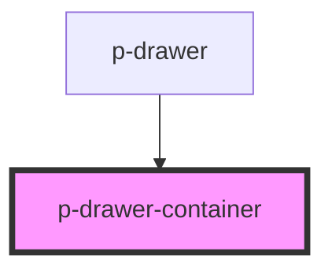

# Modal Container

## Usage:

```html
<p-drawer-container>
    <!-- content -->
</p-drawer-container>
```

<!-- Auto Generated Below -->


## Dependencies

### Used by

 - [p-drawer](../../organisms/drawer)

### Graph


----------------------------------------------

*Built with [StencilJS](https://stenciljs.com/)*
