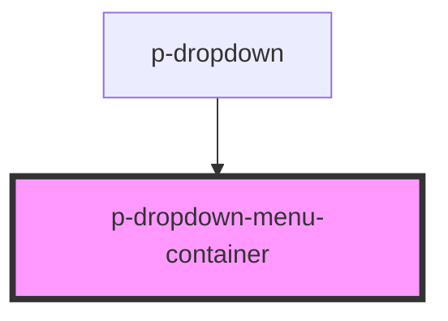

# Dropdown Menu Container

## Usage:

```html
<p-dropdown-menu-container>
    <p-dropdown-menu-item>Item 1</p-dropdown-menu-item>
    <p-dropdown-menu-item>Item 2</p-dropdown-menu-item>
    <p-dropdown-menu-item>Item 3</p-dropdown-menu-item>
</p-dropdown-menu-container>
```

<!-- Auto Generated Below -->


## Properties

| Property        | Attribute        | Description                                                          | Type                                          | Default     |
| --------------- | ---------------- | -------------------------------------------------------------------- | --------------------------------------------- | ----------- |
| `allowOverflow` | `allow-overflow` | Wether to allow overflow                                             | `boolean`                                     | `false`     |
| `class`         | `class`          | The class of the container passed by parent                          | `string`                                      | `undefined` |
| `fullWidth`     | `full-width`     | Wether the container should all available space                      | `boolean`                                     | `true`      |
| `maxWidth`      | `max-width`      | Wether the container applies it's max width                          | `boolean`                                     | `true`      |
| `scrollable`    | `scrollable`     | Wether the container should be scrollable when the threshold is met. | `"default" \| "large" \| "xlarge" \| boolean` | `false`     |


## Dependencies

### Used by

 - [p-dropdown](../../molecules/dropdown)

### Graph


----------------------------------------------

*Built with [StencilJS](https://stenciljs.com/)*
