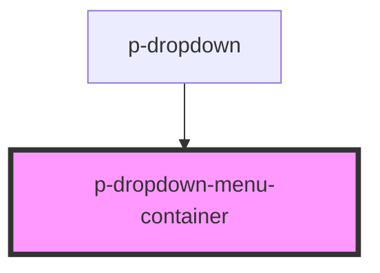

# Dropdown Menu Container

## Usage:

```html
<p-dropdown-menu-container>
    <p-dropdown-menu-item>Item 1</p-dropdown-menu-item>
    <p-dropdown-menu-item>Item 2</p-dropdown-menu-item>
    <p-dropdown-menu-item>Item 3</p-dropdown-menu-item>
</p-dropdown-menu-container>
```

<!-- Auto Generated Below -->


## Dependencies

### Used by

 - [p-dropdown](../../molecules/dropdown)

### Graph


----------------------------------------------

*Built with [StencilJS](https://stenciljs.com/)*
