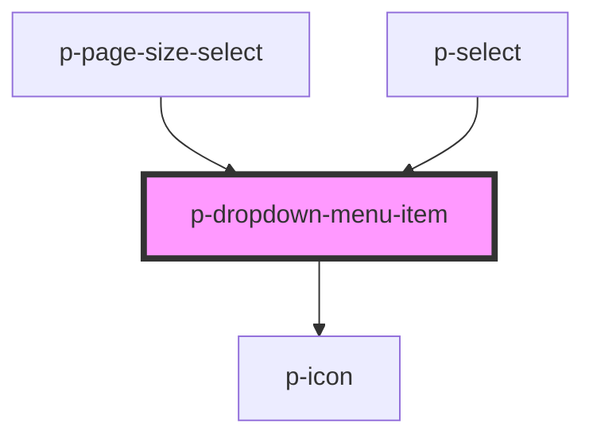

# p-dropdown-menu-item

<!-- Auto Generated Below -->

## Properties

| Property       | Attribute       | Description                             | Type                                                                                                                                                                                                                                                                                                                                                                                                                                                                                                                                                                                                                                                                                                                                                                                                                                                              | Default     |
| -------------- | --------------- | --------------------------------------- | ----------------------------------------------------------------------------------------------------------------------------------------------------------------------------------------------------------------------------------------------------------------------------------------------------------------------------------------------------------------------------------------------------------------------------------------------------------------------------------------------------------------------------------------------------------------------------------------------------------------------------------------------------------------------------------------------------------------------------------------------------------------------------------------------------------------------------------------------------------------- | ----------- |
| `active`       | `active`        | Wether the dropdown menu item is active | `boolean`                                                                                                                                                                                                                                                                                                                                                                                                                                                                                                                                                                                                                                                                                                                                                                                                                                                         | `false`     |
| `disabled`     | `disabled`      | Wether the item is disabled             | `boolean`                                                                                                                                                                                                                                                                                                                                                                                                                                                                                                                                                                                                                                                                                                                                                                                                                                                         | `false`     |
| `enableHover`  | `enable-hover`  | Wether to enable the hover state        | `boolean`                                                                                                                                                                                                                                                                                                                                                                                                                                                                                                                                                                                                                                                                                                                                                                                                                                                         | `true`      |
| `icon`         | `icon`          | Icon of the navigation item             | `"arrow" \| "attachment" \| "bread" \| "calendar" \| "camera" \| "car" \| "checklist" \| "checkmark" \| "chevron" \| "chevrons" \| "clock" \| "colleagues" \| "cogs" \| "comment" \| "companies" \| "company" \| "deactivate" \| "document" \| "download" \| "envelope" \| "explanation" \| "eye" \| "faPiggy" \| "filter" \| "folder" \| "formula" \| "grid" \| "hashtag" \| "headset" \| "hidden" \| "iDeal" \| "integration" \| "list" \| "location" \| "lock" \| "megaphone" \| "menu" \| "minus" \| "more" \| "negative" \| "notification" \| "pagination" \| "payment" \| "pencil" \| "person" \| "plan" \| "plus" \| "question" \| "reload" \| "receipt" \| "report" \| "review" \| "search" \| "settings" \| "sick" \| "signout" \| "switch" \| "tachometer" \| "task" \| "template" \| "tool" \| "trash" \| "turn" \| "unlock" \| "upload" \| "warning"` | `undefined` |
| `useContainer` | `use-container` | wether to use the container for text    | `boolean`                                                                                                                                                                                                                                                                                                                                                                                                                                                                                                                                                                                                                                                                                                                                                                                                                                                         | `true`      |
| `variant`      | `variant`       | The variant of the item                 | `"checkbox" \| "default"`                                                                                                                                                                                                                                                                                                                                                                                                                                                                                                                                                                                                                                                                                                                                                                                                                                         | `'default'` |

## Dependencies

### Used by

 - [p-page-size-select](../../molecules/page-size-select)
 - [p-select](../../molecules/select)

### Depends on

- [p-icon](../icon)

### Graph

----------------------------------------------

*Built with [StencilJS](https://stenciljs.com/)*
