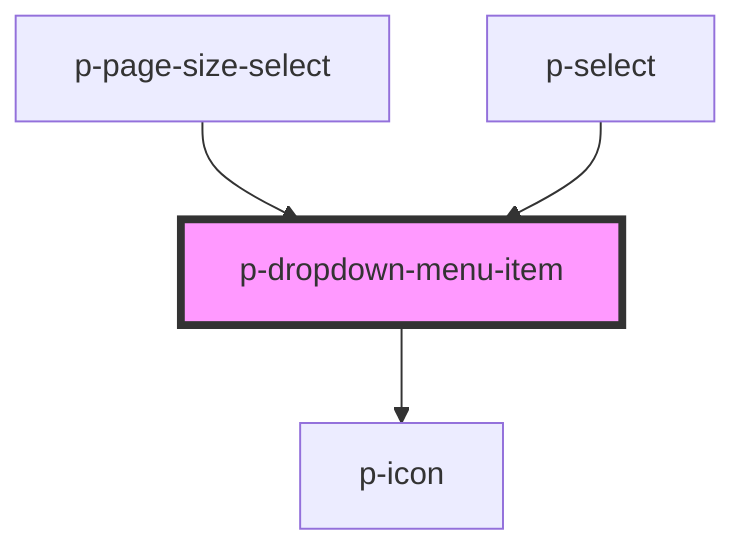

# p-dropdown-menu-item

<!-- Auto Generated Below -->

## Properties

| Property       | Attribute       | Description                             | Type                                                                                                                                                                                                                                                                                                                                                                                                                                                                                                                                                                                                                                                                                                                                                                                                                                                                                                                                                                                                                                                                                                                                                                                                                                                                                                                                                                | Default     |
| -------------- | --------------- | --------------------------------------- | ------------------------------------------------------------------------------------------------------------------------------------------------------------------------------------------------------------------------------------------------------------------------------------------------------------------------------------------------------------------------------------------------------------------------------------------------------------------------------------------------------------------------------------------------------------------------------------------------------------------------------------------------------------------------------------------------------------------------------------------------------------------------------------------------------------------------------------------------------------------------------------------------------------------------------------------------------------------------------------------------------------------------------------------------------------------------------------------------------------------------------------------------------------------------------------------------------------------------------------------------------------------------------------------------------------------------------------------------------------------- | ----------- |
| `active`       | `active`        | Wether the dropdown menu item is active | `boolean`                                                                                                                                                                                                                                                                                                                                                                                                                                                                                                                                                                                                                                                                                                                                                                                                                                                                                                                                                                                                                                                                                                                                                                                                                                                                                                                                                           | `false`     |
| `disabled`     | `disabled`      | Wether the item is disabled             | `boolean`                                                                                                                                                                                                                                                                                                                                                                                                                                                                                                                                                                                                                                                                                                                                                                                                                                                                                                                                                                                                                                                                                                                                                                                                                                                                                                                                                           | `false`     |
| `enableHover`  | `enable-hover`  | Wether to enable the hover state        | `boolean`                                                                                                                                                                                                                                                                                                                                                                                                                                                                                                                                                                                                                                                                                                                                                                                                                                                                                                                                                                                                                                                                                                                                                                                                                                                                                                                                                           | `true`      |
| `icon`         | `icon`          | Icon of the navigation item             | `"caret" \| "double-caret" \| "arrow" \| "double-arrow" \| "bell" \| "chat" \| "check-circle" \| "cross-circle" \| "error-circle" \| "info-circle" \| "phone" \| "question-circle" \| "headset" \| "warning" \| "attachment" \| "description" \| "document" \| "folder" \| "pdf" \| "xls" \| "bank" \| "bread" \| "cake" \| "calculator" \| "camera" \| "car" \| "certified" \| "chair" \| "checkmark" \| "city" \| "companies" \| "company" \| "credit-card" \| "cutlery" \| "department" \| "diamond" \| "docter" \| "download" \| "envelope" \| "euro" \| "exam" \| "filter" \| "flower" \| "globe" \| "globe-2" \| "hash" \| "hat" \| "home" \| "integration" \| "language" \| "laptop" \| "location" \| "mail" \| "medal" \| "menu" \| "menu-arrow" \| "minus" \| "more" \| "negative" \| "other" \| "pay" \| "pencil" \| "percent" \| "pie-chart" \| "placeholder" \| "plus" \| "power" \| "receipt" \| "reset" \| "search" \| "send" \| "settings" \| "shuffle" \| "sick" \| "signature" \| "sparkle" \| "star" \| "stroller" \| "tag" \| "tasks" \| "tools" \| "tooth" \| "train" \| "trash" \| "upload" \| "wave" \| "zipcode" \| "eye" \| "eye-closed" \| "key" \| "lock" \| "unlocked" \| "alarm" \| "calendar" \| "calendar-multi" \| "calendar-free" \| "calendar-not-free" \| "clock" \| "female" \| "id" \| "id-two" \| "male" \| "user" \| "users"` | `undefined` |
| `useContainer` | `use-container` | wether to use the container for text    | `boolean`                                                                                                                                                                                                                                                                                                                                                                                                                                                                                                                                                                                                                                                                                                                                                                                                                                                                                                                                                                                                                                                                                                                                                                                                                                                                                                                                                           | `true`      |
| `variant`      | `variant`       | The variant of the item                 | `"checkbox" \| "default"`                                                                                                                                                                                                                                                                                                                                                                                                                                                                                                                                                                                                                                                                                                                                                                                                                                                                                                                                                                                                                                                                                                                                                                                                                                                                                                                                           | `'default'` |

## Dependencies

### Used by

 - [p-page-size-select](../../molecules/page-size-select)
 - [p-select](../../molecules/select)

### Depends on

- [p-icon](../icon)

### Graph

----------------------------------------------

*Built with [StencilJS](https://stenciljs.com/)*
