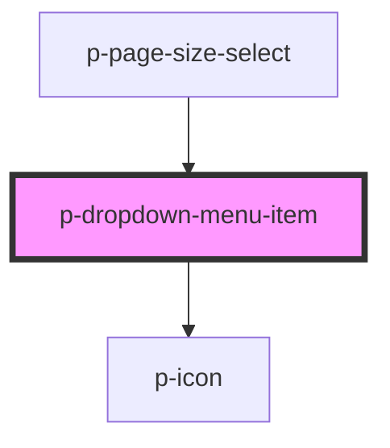

# p-dropdown-menu-item

<!-- Auto Generated Below -->

## Properties

| Property | Attribute | Description                             | Type                                                                                                                                                                                                                                                                                                                                                                                                                                                                                                                                                                                                                                            | Default     |
| -------- | --------- | --------------------------------------- | ----------------------------------------------------------------------------------------------------------------------------------------------------------------------------------------------------------------------------------------------------------------------------------------------------------------------------------------------------------------------------------------------------------------------------------------------------------------------------------------------------------------------------------------------------------------------------------------------------------------------------------------------- | ----------- |
| `active` | `active`  | Wether the dropdown menu item is active | `boolean`                                                                                                                                                                                                                                                                                                                                                                                                                                                                                                                                                                                                                                       | `false`     |
| `icon`   | `icon`    | Icon of the navigation item             | `"arrow" \| "attachment" \| "bread" \| "calendar" \| "camera" \| "car" \| "checklist" \| "checkmark" \| "chevron" \| "clock" \| "cogs" \| "comment" \| "document" \| "download" \| "envelope" \| "explanation" \| "eye" \| "filter" \| "folder" \| "grid" \| "headset" \| "integration" \| "list" \| "location" \| "megaphone" \| "menu" \| "minus" \| "more" \| "negative" \| "pagination" \| "payment" \| "pencil" \| "person" \| "plus" \| "question" \| "receipt" \| "report" \| "search" \| "settings" \| "sick" \| "signout" \| "switch" \| "tachometer" \| "task" \| "template" \| "tool" \| "trash" \| "turn" \| "upload" \| "warning"` | `undefined` |

## Dependencies

### Used by

 - [p-page-size-select](../../molecules/page-size-select)

### Depends on

- [p-icon](../icon)

### Graph

----------------------------------------------

*Built with [StencilJS](https://stenciljs.com/)*
