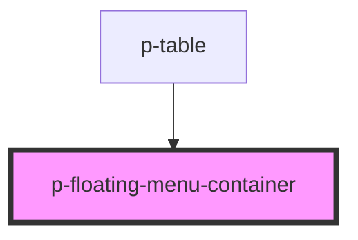

# Floating Menu Container

## Usage:

```html
<p-floating-menu-container />

<!-- or -->

<p-floating-menu-container> Content </p-floating-menu-container>
```

<!-- Auto Generated Below -->


## Properties

| Property      | Attribute       | Description                                | Type      | Default |
| ------------- | --------------- | ------------------------------------------ | --------- | ------- |
| `usedInTable` | `used-in-table` | Weather the container is used in the table | `boolean` | `false` |


## Dependencies

### Used by

 - [p-table](../../organisms/table)

### Graph


----------------------------------------------

*Built with [StencilJS](https://stenciljs.com/)*
