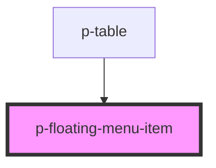

# Floating Menu Item

## Usage:

```html
<p-floating-menu-item> Content </p-floating-menu-item>
```

<!-- Auto Generated Below -->


## Properties

| Property | Attribute | Description                   | Type      | Default |
| -------- | --------- | ----------------------------- | --------- | ------- |
| `hover`  | `hover`   | The variant of the modal body | `boolean` | `true`  |


## Dependencies

### Used by

 - [p-table](../../organisms/table)

### Graph


----------------------------------------------

*Built with [StencilJS](https://stenciljs.com/)*
