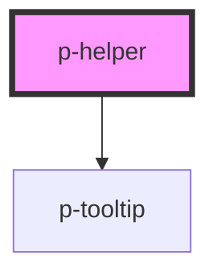

# Helper

## Usage:

```html
<p-helper>Content of the tooltip</p-helper>
```

<!-- Auto Generated Below -->


## Dependencies

### Depends on

- [p-tooltip](../tooltip)

### Graph


----------------------------------------------

*Built with [StencilJS](https://stenciljs.com/)*
