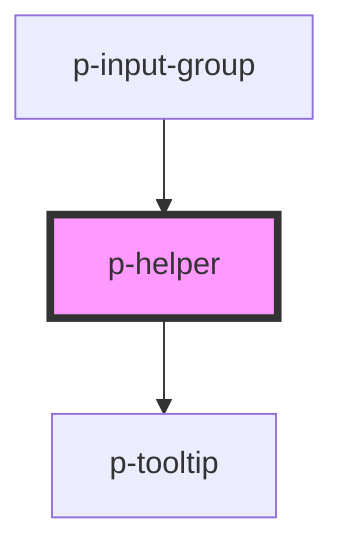

# Helper

## Usage:

```html
<p-helper>Content of the tooltip</p-helper>
```

<!-- Auto Generated Below -->


## Properties

| Property    | Attribute   | Description                         | Type                                                                                                                                                                                                         | Default |
| ----------- | ----------- | ----------------------------------- | ------------------------------------------------------------------------------------------------------------------------------------------------------------------------------------------------------------ | ------- |
| `placement` | `placement` | The placement of the helper popover | `"auto" \| "auto-end" \| "auto-start" \| "bottom" \| "bottom-end" \| "bottom-start" \| "left" \| "left-end" \| "left-start" \| "right" \| "right-end" \| "right-start" \| "top" \| "top-end" \| "top-start"` | `'top'` |


## Dependencies

### Used by

 - [p-input-group](../../molecules/input-group)

### Depends on

- [p-tooltip](../tooltip)

### Graph


----------------------------------------------

*Built with [StencilJS](https://stenciljs.com/)*
