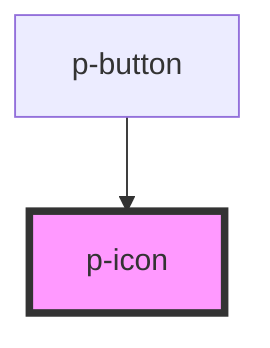

# Icon

## Usage:

```html
<p-icon variant="name" />
```

<!-- Auto Generated Below -->


## Properties

| Property               | Attribute | Description                                        | Type                                                                                                                                                                                                                                                                                                                                                                                                                                                                                                               | Default     |
| ---------------------- | --------- | -------------------------------------------------- | ------------------------------------------------------------------------------------------------------------------------------------------------------------------------------------------------------------------------------------------------------------------------------------------------------------------------------------------------------------------------------------------------------------------------------------------------------------------------------------------------------------------ | ----------- |
| `flip`                 | `flip`    | Wether to flip the icon horizontally or vertically | `"horizontal" \| "vertical"`                                                                                                                                                                                                                                                                                                                                                                                                                                                                                       | `null`      |
| `rotate`               | `rotate`  | Wether to rotate the icon x degrees                | `number`                                                                                                                                                                                                                                                                                                                                                                                                                                                                                                           | `null`      |
| `size`                 | `size`    | The size of the icon, using tailwind sizes         | `string`                                                                                                                                                                                                                                                                                                                                                                                                                                                                                                           | `'auto'`    |
| `variant` _(required)_ | `variant` | The icon the be displayed                          | `"arrow" \| "attachment" \| "bread" \| "calendar" \| "car" \| "checkmark" \| "chevron" \| "clock" \| "cogs" \| "comment" \| "document" \| "download" \| "envelope" \| "explanation" \| "eye" \| "filter" \| "grid" \| "headset" \| "list" \| "location" \| "megaphone" \| "minus" \| "negative" \| "pagination" \| "payment" \| "pencil" \| "person" \| "plus" \| "question" \| "receipt" \| "report" \| "search" \| "settings" \| "sick" \| "tachometer" \| "tool" \| "trash" \| "turn" \| "upload" \| "warning"` | `undefined` |


## Dependencies

### Used by

 - [p-button](../button)

### Graph


----------------------------------------------

*Built with [StencilJS](https://stenciljs.com/)*
