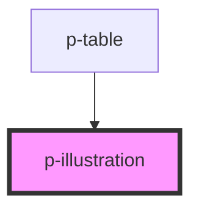

# Illustration

<!-- Auto Generated Below -->

## Properties

| Property               | Attribute | Description               | Type                                                                                                                                                                                                             | Default     |
| ---------------------- | --------- | ------------------------- | ---------------------------------------------------------------------------------------------------------------------------------------------------------------------------------------------------------------- | ----------- |
| `variant` _(required)_ | `variant` | The icon the be displayed | `"departments" \| "e-mail" \| "empty-state" \| "empty-state-add" \| "empty-state-overview" \| "empty-state-search" \| "expenses" \| "functions" \| "questions" \| "sick-leave" \| "time-off" \| "upgrade-to-hr"` | `undefined` |

## Dependencies

### Used by

 - [p-table](../../organisms/table)

### Graph

----------------------------------------------

*Built with [StencilJS](https://stenciljs.com/)*
