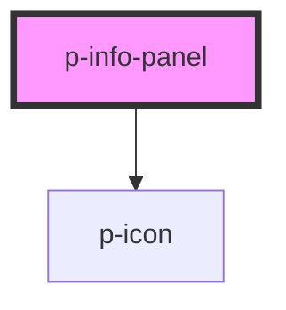

# Info Panel

## Usage:

```html
<p-info-panel>
    <span slot="header">Title</span>
    <span slot="content">Content</span>
</p-info-panel>
```

<!-- Auto Generated Below -->


## Properties

| Property    | Attribute   | Description                    | Type                                               | Default     |
| ----------- | ----------- | ------------------------------ | -------------------------------------------------- | ----------- |
| `closeable` | `closeable` | Wether the panel can be closed | `boolean`                                          | `false`     |
| `content`   | `content`   | The content of the info panel  | `string`                                           | `undefined` |
| `header`    | `header`    | The header of the info panel   | `string`                                           | `undefined` |
| `variant`   | `variant`   | The variant of the info panel  | `"info" \| "negative" \| "positive" \| "unbiased"` | `'info'`    |


## Events

| Event    | Description                  | Type                |
| -------- | ---------------------------- | ------------------- |
| `closed` | When the backdrop is clicked | `CustomEvent<void>` |


## Dependencies

### Depends on

- [p-icon](../icon)

### Graph


----------------------------------------------

*Built with [StencilJS](https://stenciljs.com/)*
