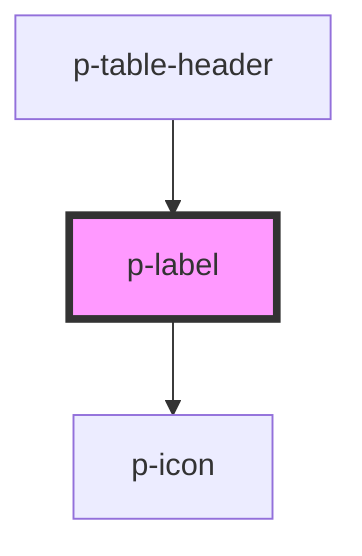

# Label

## Usage:

```html
<p-label>
    <!-- content -->
</p-label>
```

<!-- Auto Generated Below -->


## Properties

| Property            | Attribute             | Description                          | Type                                                                                                                                                                                                                                                                                                                                                                                                                                                                                                                                                                                                                                                                                                                                                             | Default     |
| ------------------- | --------------------- | ------------------------------------ | ---------------------------------------------------------------------------------------------------------------------------------------------------------------------------------------------------------------------------------------------------------------------------------------------------------------------------------------------------------------------------------------------------------------------------------------------------------------------------------------------------------------------------------------------------------------------------------------------------------------------------------------------------------------------------------------------------------------------------------------------------------------- | ----------- |
| `behavior`          | `behavior`            | Define the behavior of the label     | `"circle" \| "combination" \| "icon" \| "icon-only" \| "text"`                                                                                                                                                                                                                                                                                                                                                                                                                                                                                                                                                                                                                                                                                                   | `'circle'`  |
| `icon`              | `icon`                | Icon to show on the label            | `"negative" \| "arrow" \| "attachment" \| "bread" \| "calendar" \| "camera" \| "car" \| "checklist" \| "checkmark" \| "chevron" \| "clock" \| "colleagues" \| "cogs" \| "comment" \| "companies" \| "document" \| "download" \| "envelope" \| "explanation" \| "eye" \| "faBuilding" \| "faPiggy" \| "filter" \| "folder" \| "formula" \| "grid" \| "headset" \| "integration" \| "list" \| "location" \| "megaphone" \| "menu" \| "minus" \| "more" \| "notification" \| "pagination" \| "payment" \| "pencil" \| "person" \| "plan" \| "plus" \| "question" \| "reload" \| "receipt" \| "report" \| "search" \| "settings" \| "sick" \| "signout" \| "switch" \| "tachometer" \| "task" \| "template" \| "tool" \| "trash" \| "turn" \| "upload" \| "warning"` | `undefined` |
| `iconFlip`          | `icon-flip`           | Icon flip                            | `"horizontal" \| "vertical"`                                                                                                                                                                                                                                                                                                                                                                                                                                                                                                                                                                                                                                                                                                                                     | `undefined` |
| `iconPosition`      | `icon-position`       | Icon position                        | `"end" \| "start"`                                                                                                                                                                                                                                                                                                                                                                                                                                                                                                                                                                                                                                                                                                                                               | `'start'`   |
| `iconRotate`        | `icon-rotate`         | Icon rotate                          | `-135 \| -180 \| -225 \| -25 \| -270 \| -315 \| -45 \| -90 \| 0 \| 135 \| 180 \| 225 \| 25 \| 270 \| 315 \| 45 \| 90`                                                                                                                                                                                                                                                                                                                                                                                                                                                                                                                                                                                                                                            | `undefined` |
| `keepMobileContent` | `keep-mobile-content` | Wether to keep the content on mobile | `boolean`                                                                                                                                                                                                                                                                                                                                                                                                                                                                                                                                                                                                                                                                                                                                                        | `false`     |
| `size`              | `size`                | The size of the label                | `"default" \| "small"`                                                                                                                                                                                                                                                                                                                                                                                                                                                                                                                                                                                                                                                                                                                                           | `'default'` |
| `variant`           | `variant`             | Variant of the label                 | `"info" \| "negative" \| "neutral" \| "positive" \| "unbiased"`                                                                                                                                                                                                                                                                                                                                                                                                                                                                                                                                                                                                                                                                                                  | `'neutral'` |


## Dependencies

### Used by

 - [p-table-header](../../molecules/table-header)

### Depends on

- [p-icon](../icon)

### Graph


----------------------------------------------

*Built with [StencilJS](https://stenciljs.com/)*
