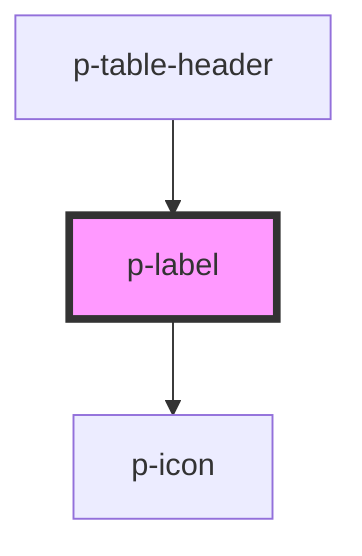

# Label

## Usage:

```html
<p-label>
    <!-- content -->
</p-label>
```

<!-- Auto Generated Below -->


## Properties

| Property     | Attribute     | Description                     | Type                                                                                                                                                                                                                                                                                                                                                                                                                                                                                                                                                                                                                                            | Default     |
| ------------ | ------------- | ------------------------------- | ----------------------------------------------------------------------------------------------------------------------------------------------------------------------------------------------------------------------------------------------------------------------------------------------------------------------------------------------------------------------------------------------------------------------------------------------------------------------------------------------------------------------------------------------------------------------------------------------------------------------------------------------- | ----------- |
| `circle`     | `circle`      | Wether to add the circle or not | `boolean`                                                                                                                                                                                                                                                                                                                                                                                                                                                                                                                                                                                                                                       | `true`      |
| `icon`       | `icon`        | Icon to show on the button      | `"arrow" \| "attachment" \| "bread" \| "calendar" \| "camera" \| "car" \| "checklist" \| "checkmark" \| "chevron" \| "clock" \| "cogs" \| "comment" \| "document" \| "download" \| "envelope" \| "explanation" \| "eye" \| "filter" \| "folder" \| "grid" \| "headset" \| "integration" \| "list" \| "location" \| "megaphone" \| "menu" \| "minus" \| "more" \| "negative" \| "pagination" \| "payment" \| "pencil" \| "person" \| "plus" \| "question" \| "receipt" \| "report" \| "search" \| "settings" \| "sick" \| "signout" \| "switch" \| "tachometer" \| "task" \| "template" \| "tool" \| "trash" \| "turn" \| "upload" \| "warning"` | `'plus'`    |
| `iconFlip`   | `icon-flip`   | Icon flip                       | `"horizontal" \| "vertical"`                                                                                                                                                                                                                                                                                                                                                                                                                                                                                                                                                                                                                    | `undefined` |
| `iconOnly`   | `icon-only`   | Wether it's icon only           | `boolean`                                                                                                                                                                                                                                                                                                                                                                                                                                                                                                                                                                                                                                       | `false`     |
| `iconRotate` | `icon-rotate` | Icon rotate                     | `-135 \| -180 \| -225 \| -25 \| -270 \| -315 \| -45 \| -90 \| 0 \| 135 \| 180 \| 225 \| 25 \| 270 \| 315 \| 45 \| 90`                                                                                                                                                                                                                                                                                                                                                                                                                                                                                                                           | `undefined` |
| `mobileIcon` | `mobile-icon` | Wether to show icon on mobile   | `boolean`                                                                                                                                                                                                                                                                                                                                                                                                                                                                                                                                                                                                                                       | `true`      |
| `size`       | `size`        | The size of the label           | `"default" \| "small"`                                                                                                                                                                                                                                                                                                                                                                                                                                                                                                                                                                                                                          | `'default'` |
| `variant`    | `variant`     | Variant of the label            | `"info" \| "negative" \| "positive" \| "unbiased"`                                                                                                                                                                                                                                                                                                                                                                                                                                                                                                                                                                                              | `'info'`    |


## Dependencies

### Used by

 - [p-table-header](../../molecules/table-header)

### Depends on

- [p-icon](../icon)

### Graph


----------------------------------------------

*Built with [StencilJS](https://stenciljs.com/)*
