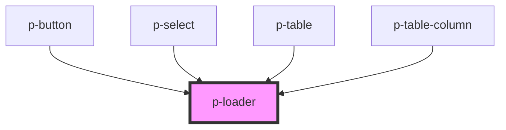

# Loader

## Usage:

```html
<p-loader />
```

<!-- Auto Generated Below -->


## Properties

| Property           | Attribute           | Description                                           | Type                                                              | Default     |
| ------------------ | ------------------- | ----------------------------------------------------- | ----------------------------------------------------------------- | ----------- |
| `color`            | `color`             | Color of the loader                                   | `"indigo" \| "storm" \| "white"`                                  | `'indigo'`  |
| `modalDescription` | `modal-description` | !NOT IMPLEMENTED! Modal description for modal variant | `string`                                                          | `undefined` |
| `modalTitle`       | `modal-title`       | !NOT IMPLEMENTED! Modal title for modal variant       | `string`                                                          | `undefined` |
| `show`             | `show`              | Wether to show or hide the loader                     | `Observable<boolean> \| boolean`                                  | `true`      |
| `variant`          | `variant`           | Variant of loader                                     | `"full-screen" \| "full-width" \| "ghost" \| "inline" \| "modal"` | `'inline'`  |


## Dependencies

### Used by

 - [p-button](../button)
 - [p-select](../../molecules/select)
 - [p-table](../../organisms/table)
 - [p-table-column](../../molecules/table-column)

### Graph


----------------------------------------------

*Built with [StencilJS](https://stenciljs.com/)*
