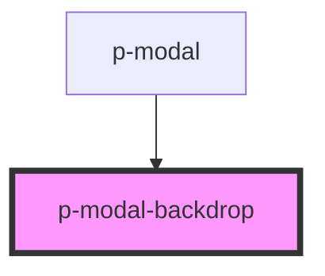

# Modal backdrop

## Usage:

```html
<p-modal-backdrop />
```

<!-- Auto Generated Below -->


## Dependencies

### Used by

 - [p-modal](../../molecules/modal)

### Graph


----------------------------------------------

*Built with [StencilJS](https://stenciljs.com/)*
