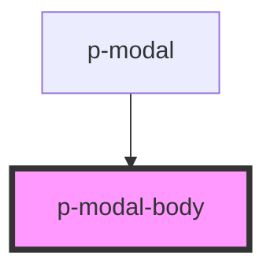

# Modal Body

## Usage:

```html
<p-modal-body>
    <!-- content -->
</p-modal-body>
```

<!-- Auto Generated Below -->


## Properties

| Property  | Attribute | Description                                           | Type                         | Default     |
| --------- | --------- | ----------------------------------------------------- | ---------------------------- | ----------- |
| `padding` | `padding` | Wether the body should have padding                   | `boolean`                    | `true`      |
| `rounded` | `rounded` | Wether the modal body should be rounded at the bottom | `boolean`                    | `false`     |
| `variant` | `variant` | The variant of the modal body                         | `"default" \| "table-flush"` | `'default'` |


## Dependencies

### Used by

 - [p-modal](../../organisms/modal)

### Graph


----------------------------------------------

*Built with [StencilJS](https://stenciljs.com/)*
