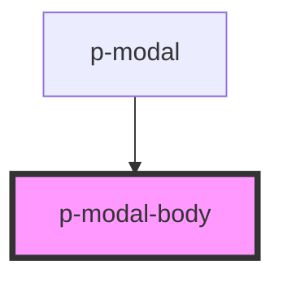

# p-modal-body

<!-- Auto Generated Below -->

## Properties

| Property  | Attribute | Description                   | Type                   | Default     |
| --------- | --------- | ----------------------------- | ---------------------- | ----------- |
| `variant` | `variant` | The variant of the modal body | `"default" \| "table"` | `'default'` |

## Dependencies

### Used by

 - [p-modal](../../molecules/modal)

### Graph

----------------------------------------------

*Built with [StencilJS](https://stenciljs.com/)*
