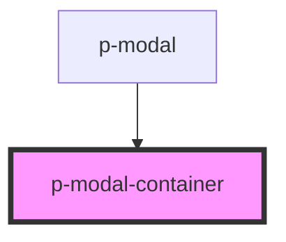

# p-modal-container

<!-- Auto Generated Below -->

## Properties

| Property | Attribute | Description                     | Type                           | Default |
| -------- | --------- | ------------------------------- | ------------------------------ | ------- |
| `size`   | `size`    | The size of the modal container | `"lg" \| "md" \| "sm" \| "xl"` | `'md'`  |

## Dependencies

### Used by

 - [p-modal](../../molecules/modal)

### Graph

----------------------------------------------

*Built with [StencilJS](https://stenciljs.com/)*
