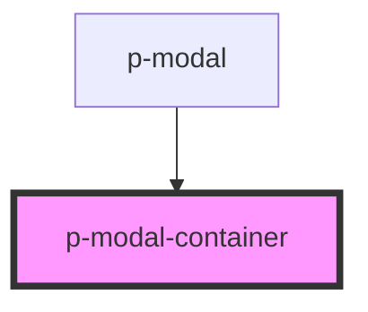

# Modal Container

## Usage:

```html
<p-modal-container>
    <!-- content -->
</p-modal-container>
```

<!-- Auto Generated Below -->


## Properties

| Property  | Attribute | Description                     | Type                           | Default |
| --------- | --------- | ------------------------------- | ------------------------------ | ------- |
| `closing` | `closing` | Wether the container is closing | `boolean`                      | `false` |
| `size`    | `size`    | The size of the modal container | `"lg" \| "md" \| "sm" \| "xl"` | `'md'`  |


## Dependencies

### Used by

 - [p-modal](../../organisms/modal)

### Graph


----------------------------------------------

*Built with [StencilJS](https://stenciljs.com/)*
