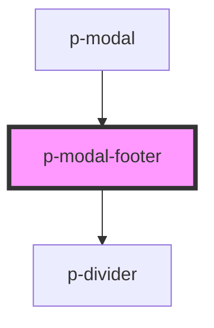

# p-modal-footer

<!-- Auto Generated Below -->

## Dependencies

### Used by

 - [p-modal](../../organisms/modal)

### Depends on

- [p-divider](../divider)

### Graph

----------------------------------------------

*Built with [StencilJS](https://stenciljs.com/)*
