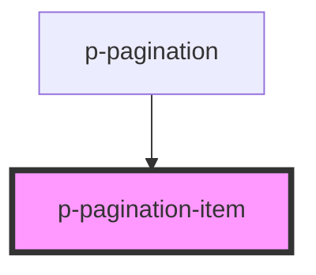

# Pagination Item

## Usage:

```html
<p-pagination-item>#</p-pagination-item>
```

<!-- Auto Generated Below -->


## Properties

| Property | Attribute | Description                          | Type      | Default |
| -------- | --------- | ------------------------------------ | --------- | ------- |
| `active` | `active`  | Wether the pagination item is active | `boolean` | `false` |


## Dependencies

### Used by

 - [p-pagination](../../molecules/pagination)

### Graph


----------------------------------------------

*Built with [StencilJS](https://stenciljs.com/)*
