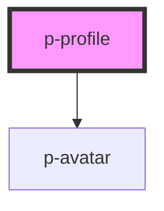

# Profile

## Usage:

```html
<p-profile>
    <p-avatar slot="avatar" />
    <span slot="title"> <!-- title --> </span>
    <span slot="subtitle"> <!-- subtitle --> </span>
</p-profile>
```

<!-- Auto Generated Below -->


## Dependencies

### Depends on

- [p-avatar](../avatar)

### Graph


----------------------------------------------

*Built with [StencilJS](https://stenciljs.com/)*
