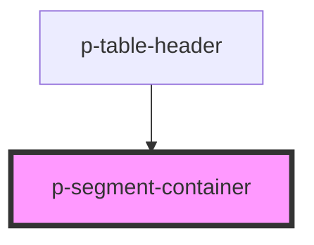

# Segment Container

## Usage:

```html
<p-segment-container>
    <p-segment-item>Item 1</p-segment-item>
    <p-segment-item>Item 2</p-segment-item>
    <p-segment-item>Item 3</p-segment-item>
</p-segment-container>
```

<!-- Auto Generated Below -->


## Dependencies

### Used by

 - [p-table-header](../../molecules/table-header)

### Graph


----------------------------------------------

*Built with [StencilJS](https://stenciljs.com/)*
