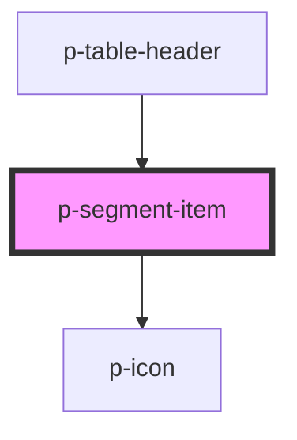

# p-segment-item

<!-- Auto Generated Below -->

## Properties

| Property     | Attribute     | Description                          | Type                                                                                                                                                                                                                                                                                                                                                                                                                                                                                                                                                                                                                                                                                                                                                                                                                            | Default     |
| ------------ | ------------- | ------------------------------------ | ------------------------------------------------------------------------------------------------------------------------------------------------------------------------------------------------------------------------------------------------------------------------------------------------------------------------------------------------------------------------------------------------------------------------------------------------------------------------------------------------------------------------------------------------------------------------------------------------------------------------------------------------------------------------------------------------------------------------------------------------------------------------------------------------------------------------------- | ----------- |
| `active`     | `active`      | Wether the segment item is active    | `boolean`                                                                                                                                                                                                                                                                                                                                                                                                                                                                                                                                                                                                                                                                                                                                                                                                                       | `false`     |
| `icon`       | `icon`        | Icon to show on the segment item     | `"arrow" \| "attachment" \| "bread" \| "calendar" \| "camera" \| "car" \| "checklist" \| "checkmark" \| "chevron" \| "chevrons" \| "clock" \| "colleagues" \| "cogs" \| "comment" \| "companies" \| "company" \| "deactivate" \| "document" \| "download" \| "envelope" \| "explanation" \| "eye" \| "faPiggy" \| "filter" \| "folder" \| "formula" \| "grid" \| "hashtag" \| "headset" \| "hidden" \| "iDeal" \| "integration" \| "list" \| "location" \| "megaphone" \| "menu" \| "minus" \| "more" \| "negative" \| "notification" \| "pagination" \| "payment" \| "pencil" \| "person" \| "plan" \| "plus" \| "question" \| "reload" \| "receipt" \| "report" \| "search" \| "settings" \| "sick" \| "signout" \| "switch" \| "tachometer" \| "task" \| "template" \| "tool" \| "trash" \| "turn" \| "upload" \| "warning"` | `undefined` |
| `iconFlip`   | `icon-flip`   | Icon flip                            | `"horizontal" \| "vertical"`                                                                                                                                                                                                                                                                                                                                                                                                                                                                                                                                                                                                                                                                                                                                                                                                    | `undefined` |
| `iconOnly`   | `icon-only`   | Wether the segment item is icon only | `boolean`                                                                                                                                                                                                                                                                                                                                                                                                                                                                                                                                                                                                                                                                                                                                                                                                                       | `false`     |
| `iconRotate` | `icon-rotate` | Icon rotate                          | `-135 \| -180 \| -225 \| -25 \| -270 \| -315 \| -45 \| -90 \| 0 \| 135 \| 180 \| 225 \| 25 \| 270 \| 315 \| 45 \| 90`                                                                                                                                                                                                                                                                                                                                                                                                                                                                                                                                                                                                                                                                                                           | `undefined` |
| `size`       | `size`        | Size of the segment item             | `"big" \| "small"`                                                                                                                                                                                                                                                                                                                                                                                                                                                                                                                                                                                                                                                                                                                                                                                                              | `'small'`   |

## Dependencies

### Used by

 - [p-table-header](../../molecules/table-header)

### Depends on

- [p-icon](../icon)

### Graph

----------------------------------------------

*Built with [StencilJS](https://stenciljs.com/)*
