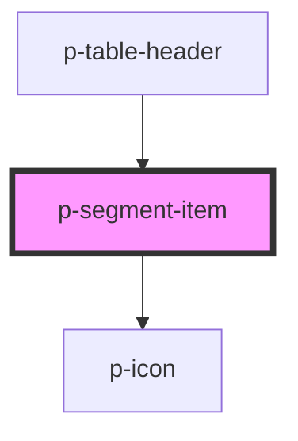

# p-segment-item

<!-- Auto Generated Below -->

## Properties

| Property     | Attribute     | Description                          | Type                                                                                                                                                                                                                                                                                                                                                                                                                                                                                                                                                                                                                                                                                                                                                                                                                                                                                                                                                                                                                                                                                                                                                                                                                                                                                                                                                                | Default     |
| ------------ | ------------- | ------------------------------------ | ------------------------------------------------------------------------------------------------------------------------------------------------------------------------------------------------------------------------------------------------------------------------------------------------------------------------------------------------------------------------------------------------------------------------------------------------------------------------------------------------------------------------------------------------------------------------------------------------------------------------------------------------------------------------------------------------------------------------------------------------------------------------------------------------------------------------------------------------------------------------------------------------------------------------------------------------------------------------------------------------------------------------------------------------------------------------------------------------------------------------------------------------------------------------------------------------------------------------------------------------------------------------------------------------------------------------------------------------------------------- | ----------- |
| `active`     | `active`      | Wether the segment item is active    | `boolean`                                                                                                                                                                                                                                                                                                                                                                                                                                                                                                                                                                                                                                                                                                                                                                                                                                                                                                                                                                                                                                                                                                                                                                                                                                                                                                                                                           | `false`     |
| `icon`       | `icon`        | Icon to show on the segment item     | `"caret" \| "double-caret" \| "arrow" \| "double-arrow" \| "bell" \| "chat" \| "check-circle" \| "cross-circle" \| "error-circle" \| "info-circle" \| "phone" \| "question-circle" \| "headset" \| "warning" \| "attachment" \| "description" \| "document" \| "folder" \| "pdf" \| "xls" \| "bank" \| "bread" \| "cake" \| "calculator" \| "camera" \| "car" \| "certified" \| "chair" \| "checkmark" \| "city" \| "companies" \| "company" \| "credit-card" \| "cutlery" \| "department" \| "diamond" \| "docter" \| "download" \| "envelope" \| "euro" \| "exam" \| "filter" \| "flower" \| "globe" \| "globe-2" \| "hash" \| "hat" \| "home" \| "integration" \| "language" \| "laptop" \| "location" \| "mail" \| "medal" \| "menu" \| "menu-arrow" \| "minus" \| "more" \| "negative" \| "other" \| "pay" \| "pencil" \| "percent" \| "pie-chart" \| "placeholder" \| "plus" \| "power" \| "receipt" \| "reset" \| "search" \| "send" \| "settings" \| "shuffle" \| "sick" \| "signature" \| "sparkle" \| "star" \| "stroller" \| "tag" \| "tasks" \| "tools" \| "tooth" \| "train" \| "trash" \| "upload" \| "wave" \| "zipcode" \| "eye" \| "eye-closed" \| "key" \| "lock" \| "unlocked" \| "alarm" \| "calendar" \| "calendar-multi" \| "calendar-free" \| "calendar-not-free" \| "clock" \| "female" \| "id" \| "id-two" \| "male" \| "user" \| "users"` | `undefined` |
| `iconFlip`   | `icon-flip`   | Icon flip                            | `"horizontal" \| "none" \| "vertical"`                                                                                                                                                                                                                                                                                                                                                                                                                                                                                                                                                                                                                                                                                                                                                                                                                                                                                                                                                                                                                                                                                                                                                                                                                                                                                                                              | `undefined` |
| `iconOnly`   | `icon-only`   | Wether the segment item is icon only | `boolean`                                                                                                                                                                                                                                                                                                                                                                                                                                                                                                                                                                                                                                                                                                                                                                                                                                                                                                                                                                                                                                                                                                                                                                                                                                                                                                                                                           | `false`     |
| `iconRotate` | `icon-rotate` | Icon rotate                          | `-135 \| -180 \| -225 \| -25 \| -270 \| -315 \| -45 \| -90 \| 0 \| 135 \| 180 \| 225 \| 25 \| 270 \| 315 \| 45 \| 90`                                                                                                                                                                                                                                                                                                                                                                                                                                                                                                                                                                                                                                                                                                                                                                                                                                                                                                                                                                                                                                                                                                                                                                                                                                               | `undefined` |
| `size`       | `size`        | Size of the segment item             | `"big" \| "small"`                                                                                                                                                                                                                                                                                                                                                                                                                                                                                                                                                                                                                                                                                                                                                                                                                                                                                                                                                                                                                                                                                                                                                                                                                                                                                                                                                  | `'small'`   |

## Dependencies

### Used by

 - [p-table-header](../../molecules/table-header)

### Depends on

- [p-icon](../icon)

### Graph

----------------------------------------------

*Built with [StencilJS](https://stenciljs.com/)*
