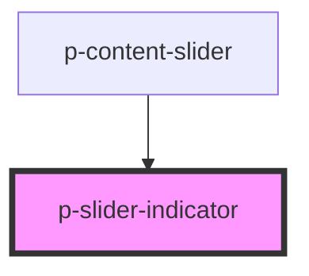

# Slider Indicator

## Usage:

```html
<p-slider-indicator />
```

<!-- Auto Generated Below -->


## Properties

| Property | Attribute | Description                           | Type      | Default |
| -------- | --------- | ------------------------------------- | --------- | ------- |
| `active` | `active`  | Wether the slider indicator is active | `boolean` | `false` |


## Dependencies

### Used by

 - [p-content-slider](../../molecules/content-slider)

### Graph


----------------------------------------------

*Built with [StencilJS](https://stenciljs.com/)*
