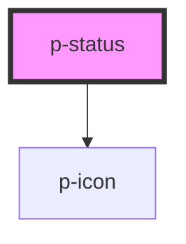

# Status

## Usage:

```html
<p-status variant="positive" icon="checkmark">Item</p-status>
```

<!-- Auto Generated Below -->


## Properties

| Property     | Attribute     | Description                | Type                                                                                                                                                                                                                                                                                                                                                                                                                                                                                                               | Default     |
| ------------ | ------------- | -------------------------- | ------------------------------------------------------------------------------------------------------------------------------------------------------------------------------------------------------------------------------------------------------------------------------------------------------------------------------------------------------------------------------------------------------------------------------------------------------------------------------------------------------------------ | ----------- |
| `icon`       | `icon`        | Icon to show on the status | `"negative" \| "arrow" \| "attachment" \| "bread" \| "calendar" \| "car" \| "checkmark" \| "chevron" \| "clock" \| "cogs" \| "comment" \| "document" \| "download" \| "envelope" \| "explanation" \| "eye" \| "filter" \| "grid" \| "headset" \| "list" \| "location" \| "megaphone" \| "minus" \| "pagination" \| "payment" \| "pencil" \| "person" \| "plus" \| "question" \| "receipt" \| "report" \| "search" \| "settings" \| "sick" \| "tachometer" \| "tool" \| "trash" \| "turn" \| "upload" \| "warning"` | `undefined` |
| `iconFlip`   | `icon-flip`   | Icon flip                  | `"horizontal" \| "vertical"`                                                                                                                                                                                                                                                                                                                                                                                                                                                                                       | `undefined` |
| `iconRotate` | `icon-rotate` | Icon rotate                | `number`                                                                                                                                                                                                                                                                                                                                                                                                                                                                                                           | `undefined` |
| `variant`    | `variant`     | The variant of the status  | `"default" \| "negative" \| "positive" \| "unbiased"`                                                                                                                                                                                                                                                                                                                                                                                                                                                              | `'default'` |


## Dependencies

### Depends on

- [p-icon](../icon)

### Graph


----------------------------------------------

*Built with [StencilJS](https://stenciljs.com/)*
