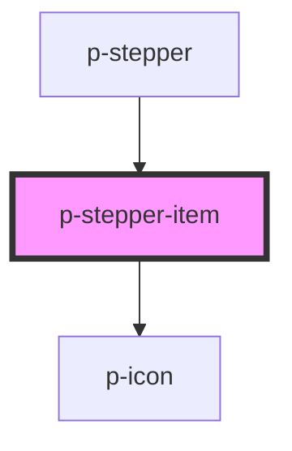

# Stepper item

## Usage:

```html
<p-stepper-item>
    <!-- content -->
</p-stepper-item>
```

<!-- Auto Generated Below -->


## Properties

| Property          | Attribute          | Description                                               | Type                           | Default        |
| ----------------- | ------------------ | --------------------------------------------------------- | ------------------------------ | -------------- |
| `active`          | `active`           | Wether the step is active                                 | `boolean`                      | `false`        |
| `align`           | `align`            | The alignment of the step content                         | `"center" \| "end" \| "start"` | `'center'`     |
| `contentPosition` | `content-position` | The position of the content in case of vertical direction | `"end" \| "start"`             | `'end'`        |
| `direction`       | `direction`        | The direction of the stepper step                         | `"horizontal" \| "vertical"`   | `'horizontal'` |
| `finished`        | `finished`         | Wether the step is finished                               | `boolean`                      | `false`        |


## Dependencies

### Used by

 - [p-stepper](../../molecules/stepper)

### Depends on

- [p-icon](../icon)

### Graph


----------------------------------------------

*Built with [StencilJS](https://stenciljs.com/)*
