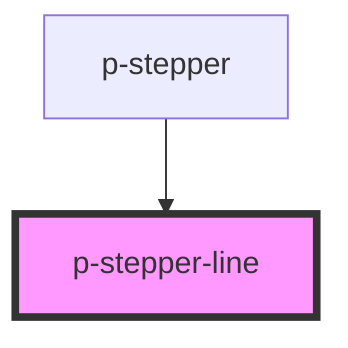

# Stepper Line

## Usage:

```html
<p-stepper-line />
```

<!-- Auto Generated Below -->

## Properties

| Property    | Attribute   | Description                       | Type                         | Default        |
| ----------- | ----------- | --------------------------------- | ---------------------------- | -------------- |
| `active`    | `active`    | Wether the line is active         | `boolean`                    | `false`        |
| `direction` | `direction` | The direction of the stepper line | `"horizontal" \| "vertical"` | `'horizontal'` |

## Dependencies

### Used by

-   [p-stepper](../../molecules/stepper)

### Graph



---

_Built with [StencilJS](https://stenciljs.com/)_
