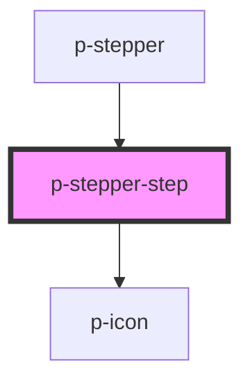

# Stepper step

## Usage:

```html
<p-stepper-step>
    <!-- content -->
</p-stepper-step>
```

<!-- Auto Generated Below -->


## Properties

| Property    | Attribute   | Description                       | Type                           | Default        |
| ----------- | ----------- | --------------------------------- | ------------------------------ | -------------- |
| `active`    | `active`    | Wether the step is active         | `boolean`                      | `false`        |
| `align`     | `align`     | The alignment of the step content | `"center" \| "end" \| "start"` | `'center'`     |
| `direction` | `direction` | The direction of the stepper step | `"horizontal" \| "vertical"`   | `'horizontal'` |
| `finished`  | `finished`  | Wether the step is finished       | `boolean`                      | `false`        |


## Dependencies

### Used by

 - [p-stepper](../../molecules/stepper)

### Depends on

- [p-icon](../icon)

### Graph


----------------------------------------------

*Built with [StencilJS](https://stenciljs.com/)*
