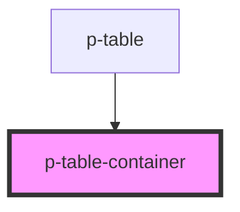

# Table Container

## Usage:

```html
<p-table-container>
    <!-- content -->
</p-table-container>
```

<!-- Auto Generated Below -->


## Properties

| Property | Attribute | Description | Type      | Default |
| -------- | --------- | ----------- | --------- | ------- |
| `shadow` | `shadow`  |             | `boolean` | `true`  |


## Dependencies

### Used by

 - [p-table](../../organisms/table)

### Graph


----------------------------------------------

*Built with [StencilJS](https://stenciljs.com/)*
