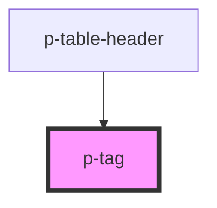

# Tag

## Usage:

```html
<p-tag>
    <!-- content -->
</p-tag>
```

<!-- Auto Generated Below -->


## Properties

| Property  | Attribute | Description                     | Type                                               | Default  |
| --------- | --------- | ------------------------------- | -------------------------------------------------- | -------- |
| `circle`  | `circle`  | Wether to add the circle or not | `boolean`                                          | `true`   |
| `variant` | `variant` | Variant of the tag              | `"info" \| "negative" \| "positive" \| "unbiased"` | `'info'` |


## Dependencies

### Used by

 - [p-table-header](../../molecules/table-header)

### Graph


----------------------------------------------

*Built with [StencilJS](https://stenciljs.com/)*
