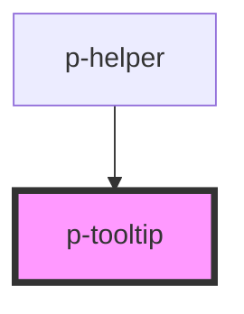

# p-tooltip

<!-- Auto Generated Below -->

## Properties

| Property    | Attribute    | Description                      | Type                                                                                                                                                                                                         | Default |
| ----------- | ------------ | -------------------------------- | ------------------------------------------------------------------------------------------------------------------------------------------------------------------------------------------------------------ | ------- |
| `content`   | `content`    | The content of the tooltip       | `any`                                                                                                                                                                                                        | `null`  |
| `forceShow` | `force-show` | Wether to force show the tooltip | `boolean`                                                                                                                                                                                                    | `false` |
| `placement` | `placement`  | The content of the tooltip       | `"auto" \| "auto-end" \| "auto-start" \| "bottom" \| "bottom-end" \| "bottom-start" \| "left" \| "left-end" \| "left-start" \| "right" \| "right-end" \| "right-start" \| "top" \| "top-end" \| "top-start"` | `'top'` |

## Dependencies

### Used by

 - [p-helper](../helper)

### Graph

----------------------------------------------

*Built with [StencilJS](https://stenciljs.com/)*
