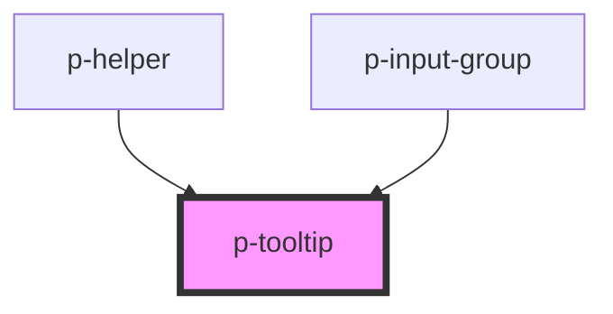

# Tooltip

## Usage:

### Hover

```html
<p-tooltip popover="Your content">
    <span slot="content">Hover me</span>
</p-tooltip>

<p-tooltip>
    <span slot="popover">Your content</span>
    <span slot="content">Hover me</span>
</p-tooltip>
```

### Click

```html
<p-tooltip variant="click" popover="Your content">
    <span slot="content">Click me</span>
</p-tooltip>

<p-tooltip variant="click">
    <span slot="popover">Your content</span>
    <span slot="content">Click me</span>
</p-tooltip>
```

### Error

```html
<p-tooltip variant="error" popover="Display an error">
    <span slot="content">
        <!-- Error content -->
    </span>
</p-tooltip>

<p-tooltip variant="click">
    <span slot="popover">Display an error</span>
    <span slot="content">
        <!-- Error content -->
    </span>
</p-tooltip>
```

<!-- Auto Generated Below -->


## Properties

| Property           | Attribute            | Description                                      | Type                                                                                                                                                                                                         | Default   |
| ------------------ | -------------------- | ------------------------------------------------ | ------------------------------------------------------------------------------------------------------------------------------------------------------------------------------------------------------------ | --------- |
| `canManuallyClose` | `can-manually-close` | Wether to someone can manually close the popover | `boolean`                                                                                                                                                                                                    | `true`    |
| `placement`        | `placement`          | The content of the popover                       | `"auto" \| "auto-end" \| "auto-start" \| "bottom" \| "bottom-end" \| "bottom-start" \| "left" \| "left-end" \| "left-start" \| "right" \| "right-end" \| "right-start" \| "top" \| "top-end" \| "top-start"` | `'top'`   |
| `popover`          | `popover`            | The content of the popover                       | `any`                                                                                                                                                                                                        | `null`    |
| `show`             | `show`               | Wether to show the popover                       | `boolean`                                                                                                                                                                                                    | `false`   |
| `variant`          | `variant`            | The variant of the popover                       | `"click" \| "error" \| "hover"`                                                                                                                                                                              | `'hover'` |


## Dependencies

### Used by

 - [p-helper](../helper)
 - [p-input-group](../../molecules/input-group)

### Graph


----------------------------------------------

*Built with [StencilJS](https://stenciljs.com/)*
