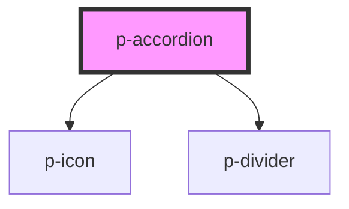

# Accordion

## Usage:

```html
<p-accordion header="Header">
    <!-- content -->
</p-accordion>
```

<!-- Auto Generated Below -->

## Properties

| Property              | Attribute   | Description                        | Type      | Default     |
| --------------------- | ----------- | ---------------------------------- | --------- | ----------- |
| `closeable`           | `closeable` | Wether the accordion can be closed | `boolean` | `true`      |
| `header` _(required)_ | `header`    | Header of the accordion            | `string`  | `undefined` |
| `open`                | `open`      | Wether the accordion is open       | `boolean` | `false`     |
| `openable`            | `openable`  | Wether the accordion can be opened | `boolean` | `true`      |

## Events

| Event    | Description       | Type                   |
| -------- | ----------------- | ---------------------- |
| `isOpen` | Open change event | `CustomEvent<boolean>` |

## Dependencies

### Depends on

-   [p-icon](../../atoms/icon)
-   [p-divider](../../atoms/divider)

### Graph



---

_Built with [StencilJS](https://stenciljs.com/)_
