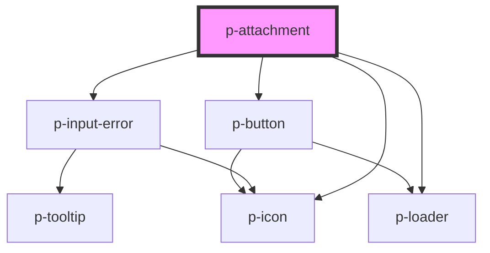

# p-attachment

<!-- Auto Generated Below -->

## Properties

| Property      | Attribute     | Description                                | Type                | Default     |
| ------------- | ------------- | ------------------------------------------ | ------------------- | ----------- |
| `downloading` | `downloading` | Wether the attachment is downloading       | `boolean`           | `false`     |
| `error`       | `error`       | The error to show                          | `string`            | `undefined` |
| `loading`     | `loading`     | Wether the attachment is uploading/loading | `boolean`           | `false`     |
| `mode`        | `mode`        | The variant of the button                  | `"read" \| "write"` | `'read'`    |

## Events

| Event      | Description                    | Type               |
| ---------- | ------------------------------ | ------------------ |
| `delete`   | Event when delete is pressed   | `CustomEvent<any>` |
| `download` | Event when download is pressed | `CustomEvent<any>` |

## Dependencies

### Depends on

- [p-icon](../../atoms/icon)
- [p-loader](../../atoms/loader)
- [p-input-error](../input-error)
- [p-button](../button)

### Graph

----------------------------------------------

*Built with [StencilJS](https://stenciljs.com/)*
